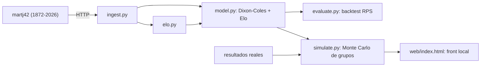

# ⚽ AlgoritmoPredict — Predictor del Mundial 2026

Modelo predictivo en **Python** para estimar el **ganador de cada partido** de la Copa del Mundo
FIFA 2026 (y, de regalo, el marcador probable y la fase de grupos completa). Combina un modelo
**Dixon-Coles** (Poisson de goles) con un **rating Elo** propio, calibrado y validado sobre
150 años de partidos internacionales, y se visualiza en un **front local autocontenido**.

**🔴 [Ver la demo en vivo →](https://borjatalaverasl.github.io/algortimomundial2026/)**

> 📊 Proyecto analítico y educativo. **No es asesoramiento de apuestas.**

---

## ⚡ Resultados

El modelo se validó con **backtesting walk-forward** sobre **3.366 partidos** de los últimos 3 años
—entrenando en cada fecha *solo con el pasado*, nunca mirando el futuro—:

| Métrica | Valor | Referencia |
|---|---:|---|
| **RPS** (métrica primaria, ↓ mejor) | **0.164** | casas de apuestas ≈ 0.18–0.19 · azar ≈ 0.239 |
| Accuracy del ganador | **~61 %** | "siempre el local" ≈ 47 % |
| Calibración | **10/10 bins dentro de ±5 pp** | cuando dice 80 %, gana ~80 % |
| Mejora sobre el baseline | **+31 %** | vs. predicción uniforme |

**Algunas predicciones del Mundial 2026** (sede neutral salvo anfitriones):

| Partido | Local | Empate | Visita |
|---|---:|---:|---:|
| 🇧🇷 Brasil – Marruecos 🇲🇦 | **50 %** | 31 % | 19 % |
| 🇩🇪 Alemania – Curaçao 🇨🇼 | **91 %** | 7 % | 2 % |
| 🇪🇸 España – Cabo Verde 🇨🇻 | **85 %** | 12 % | 3 % |
| 🇦🇷 Argentina – Argelia 🇩🇿 | **67 %** | 22 % | 11 % |

**Favoritos a ganar su grupo:** 🇦🇷 Argentina (74 %), 🇪🇸 España (72 %), 🇧🇷 Brasil (70 %),
🏴 Inglaterra (65 %), 🇫🇷 Francia (65 %). Los anfitriones reciben el empujón de la localía:
🇲🇽 México **93 %** de clasificar.

---

## 🧠 Cómo funciona

El núcleo es un **ensamble (blend) de dos modelos complementarios**:

- **Dixon-Coles** (`penaltyblog`): modela los goles de cada selección como variables de **Poisson**,
  estimando la fuerza ofensiva y defensiva de cada equipo, con la corrección clásica de Dixon-Coles
  para los marcadores bajos (0-0, 1-0…) y **decaimiento temporal** (los partidos recientes pesan más).
  De la matriz conjunta de goles se derivan el 1X2, el marcador exacto y los over/under.
- **Elo rodante propio**: recorre toda la historia actualizando el rating de cada selección
  (con K-factor, importancia por torneo, ajuste por diferencia de gol y ventaja de localía).
  El rating actual refleja la forma reciente por construcción.

El blend final pondera **70 % Dixon-Coles / 30 % Elo** con un afilado (γ = 1.15), parámetros que
**no se eligieron a ojo sino optimizando el RPS** sobre el backtest (ver *Decisiones de diseño*).

**Datos:** el histórico sale del dataset abierto [martj42/international_results](https://github.com/martj42/international_results)
—~49.400 partidos de selecciones desde 1872, servido por HTTP, sin API key ni descarga manual—.
El mismo dataset ya incluye los fixtures del Mundial 2026.

---

## 🔧 El pipeline



| # | Componente | Qué hace |
|---|---|---|
| 1 | [`ingest.py`](src/ingest.py) | Descarga y limpia los datos: normaliza nombres (identidad única por selección), deduplica, parsea la sede neutral y separa partidos jugados (entrenamiento) de fixtures a predecir. |
| 2 | [`elo.py`](src/elo.py) | Calcula el rating **Elo** rodante de las 336 selecciones. |
| 3 | [`model.py`](src/model.py) | Modelo **Dixon-Coles** + un *zoo* de predictores con interfaz común (`Uniforme`, `Elo`, `Dixon-Coles`, `Blend`) y cascada de *fallback*; produce 1X2 + marcador + over/under. |
| 4 | [`evaluate.py`](src/evaluate.py) | **Backtest walk-forward** y métricas (RPS, Brier, log-loss, accuracy, calibración). |
| 5 | [`tune.py`](src/tune.py) | Optimiza los pesos del blend y el afilado minimizando el RPS (post-hoc, sin re-entrenar). |
| 6 | [`simulate.py`](src/simulate.py) | **Monte Carlo** del torneo completo (20.000): grupos + **eliminatorias hasta la final** → probabilidad de campeón; genera el front + loop de resultados reales. |

---

## 🎯 Decisiones de diseño (con datos, no a ojo)

Lo que diferencia este proyecto es que cada decisión está respaldada por evidencia:

- **Ventana de 15 años con decaimiento.** El modelo "mira" los últimos 15 años, pesando más lo
  reciente (vida media de 6 años). Es un balance entre forma actual y tamaño de muestra.
- **Localía solo para anfitriones.** El Mundial se juega en sede neutral, así que la ventaja de
  localía se anula… *salvo* para 🇨🇦 Canadá, 🇲🇽 México y 🇺🇸 EE.UU. cuando juegan en su país
  (la ventaja, +8 a +11 pp, la **estima el modelo de los datos históricos**, no es un número inventado).
  - *Probamos* la hipótesis de que la localía rinde menos para equipos flojos → **los datos la
    rechazaron** (la ventaja es pareja en todos los niveles; correlación fuerza↔ventaja ≈ 0). No se cambió.
- **Calibración por afilado (γ).** El backtest reveló que el modelo era *sub-confiado* con los
  favoritos claros (cuando decía 80 %, ganaban 94 %). Un afilado de probabilidades lo corrigió:
  ahora los 10 bins de calibración caen dentro de ±5 pp.
- **Tuning guiado por RPS.** Los pesos del blend (70/30) y el γ se eligieron con un barrido que
  minimiza el RPS en el backtest, no por intuición.
- **Anti-overfitting.** Filosofía explícita: no se ajustan parámetros con 4 partidos (eso es pescar
  ruido). Las hipótesis se testean primero sobre cientos de partidos históricos.

---

## 🏟️ Simulación del torneo + front

`simulate.py` corre **20.000 simulaciones de Monte Carlo** de los 12 grupos: muestrea los marcadores
de cada partido, arma las tablas con los **desempates oficiales FIFA** (puntos → diferencia de gol →
goles a favor) y resuelve la clasificación (los 2 primeros de cada grupo + los **8 mejores terceros**,
formato 2026). De ahí salen las probabilidades de ganar el grupo, clasificar, y los puntos esperados.

Sobre los clasificados, el mismo motor juega el **bracket oficial 2026** (32avos → octavos → cuartos →
semis → final, con la asignación de los 8 mejores terceros a sus cruces) hasta coronar campeón. Los
partidos de eliminación **no admiten empate**: si igualan en regulación van a **penales**, y ahí pesa
el **temple de cada selección** — se usa su historial real de definiciones por penales (`shootouts.csv`,
con *shrinkage* hacia 50 % para las de pocos datos). Resultado: la **probabilidad de campeón / finalista /
semifinalista** de cada equipo, que encabeza el front en el panel **Camino al título**
(p. ej. 🇦🇷 Argentina ~15 %, 🇪🇸 España ~13 %, 🇧🇷 Brasil ~12 %).

El resultado se vuelca en **`index.html`** (en la raíz del repo, para que **GitHub Pages** lo sirva),
una página **autocontenida** (datos embebidos, sin servidor ni conexión) que **se abre con doble clic**. Diseño tipo *broadcast* deportivo, con la barra
de distribución de posición final por equipo, % de clasificación, los anfitriones marcados y las
predicciones de cada partido.

---

## 🔁 Loop de resultados reales

A medida que se juega el Mundial, se cargan los resultados en
[`assets/actual_results.csv`](assets/actual_results.csv) y al re-correr `simulate.py` el sistema:

1. **Realimenta el modelo** — los partidos jugados se suman al entrenamiento y **actualizan el Elo**
   (p. ej. Suiza −15 tras empatar siendo favorita). Las predicciones de los partidos *que faltan*
   ya usan ese Elo actualizado → es un sistema de **actualización online**.
2. **Condiciona la simulación** — fija los resultados reales y re-simula solo lo que falta.
3. **Trackea su propia precisión** — compara la predicción **pre-partido** contra la realidad
   (aciertos + RPS en vivo), usando un modelo *sin* esos resultados para que la evaluación sea
   **honesta (sin data leakage)**.

---

## 🚀 Instalación y uso

```bash
python3 -m venv .venv
.venv/bin/pip install -r requirements.txt

.venv/bin/python -m src.ingest      # 1. baja y limpia los datos
.venv/bin/python -m src.elo         # 2. calcula el rating Elo
.venv/bin/python -m src.model       # 3. predice los fixtures del Mundial
.venv/bin/python -m src.evaluate    # 4. backtest + métricas
.venv/bin/python -m src.tune        # 5. (opcional) optimiza hiperparámetros por RPS
.venv/bin/python -m src.simulate    # 6. simula la fase de grupos → web/index.html
```

Después, abrí **`index.html`** con doble clic (o miralo publicado en GitHub Pages). Toda la configuración (ventana, decaimiento,
pesos del blend, parámetros de Elo, etc.) está centralizada en [`config.yaml`](config.yaml).

---

## 📁 Estructura del proyecto

```
AlgoritmoPredict/
├── config.yaml              # parámetros centralizados del modelo y la simulación
├── requirements.txt
├── src/
│   ├── ingest.py            # 1. ingesta y limpieza (raw → clean)
│   ├── team_names.py        #    normalización de nombres / identidad de selecciones
│   ├── elo.py               # 2. rating Elo rodante
│   ├── model.py             # 3. Dixon-Coles + zoo de predictores + blend
│   ├── evaluate.py          # 4. backtest walk-forward + métricas
│   ├── tune.py              # 5. optimización de hiperparámetros (RPS)
│   └── simulate.py          # 6. Monte Carlo de la fase de grupos + front
├── assets/
│   ├── wc2026_groups.csv    # los 12 grupos oficiales (48 selecciones)
│   └── actual_results.csv   # resultados reales ya jugados (loop online)
├── index.html               # front generado, autocontenido (raíz → GitHub Pages)
├── web/
│   ├── template.html        # plantilla del front (diseño)
│   └── standings.json       # datos de la simulación (export JSON)
└── data/                    # capas raw/clean/features (generadas; no versionadas)
```

---

## 📚 Fuentes de datos

- **[martj42/international_results](https://github.com/martj42/international_results)** — histórico de
  partidos de selecciones desde 1872 (resultados de entrenamiento + fixtures del Mundial 2026).
- **Grupos del Mundial 2026** — composición oficial de los 12 grupos.

El proyecto se apoya conceptualmente en la literatura de modelos de Poisson para fútbol
(Maher 1982; Dixon & Coles 1997) y en el ecosistema de
[`penaltyblog`](https://pypi.org/project/penaltyblog/) para el ajuste del modelo de goles.

---

## ⚠️ Limitaciones

- El fútbol tiene una componente de azar grande e irreducible: ningún modelo "acierta siempre".
- El modelo base se entrena solo con **marcadores** (no usa lesiones, alineaciones ni xG todavía).
- Las probabilidades de clasificación dependen de que el **sorteo ya esté hecho** (lo está, 2026).
- El factor "hinchada" para selecciones grandes y la simulación de eliminatorias están en el roadmap.

---

## 🗺️ Roadmap

- [x] Simulación de las **eliminatorias** (bracket completo) → probabilidad de campeón.
- [ ] **Lesiones / disponibilidad** como feature de ajuste (vía API o carga manual).
- [ ] Factor **hinchada** para selecciones grandes (no por cercanía geográfica).
- [ ] Testear el efecto **"partido inaugural"** sobre históricos.

---

## 📄 Licencia

MIT — ver [LICENSE](LICENSE). Libre de usar, modificar y distribuir.

---

<sub>Hecho con Python, pandas, NumPy, SciPy y penaltyblog. Predicciones generadas localmente.</sub>
